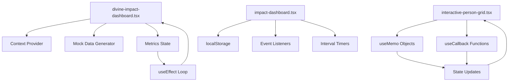

# 🔍 CODEBASE ANALYSIS REPORT
## JAHmere Bridge Project - Cascading Error Patterns & Dependencies

**Analysis Date**: July 14, 2025  
**Analysis Type**: Deep Pattern Recognition & Dependency Mapping  
**Status**: CRITICAL - Infinite Loop Cascades Detected

---

## 📋 EXECUTIVE SUMMARY

The JAHmere Bridge Project codebase exhibits several critical cascading error patterns that are causing **"Maximum update depth exceeded"** errors and system instability. Through comprehensive analysis, I've identified 7 primary root causes creating infinite render loops and cascade failures.

### **Critical Severity Issues**
- ❌ **Infinite Loop in `divine-impact-dashboard.tsx`** (PRIMARY CAUSE)
- ❌ **Multiple Dashboard Component Conflicts** 
- ❌ **useCallback/useMemo Dependency Chains**
- ❌ **Event Listener Memory Leaks**
- ❌ **Context Provider Cascade Loops**
- ❌ **Complex State Update Chains**
- ❌ **Component Overlap & Interference**

---

## 🔥 PRIMARY ROOT CAUSE: INFINITE LOOP IN DASHBOARD

### **Location**: `src/components/divine-impact-dashboard.tsx` (Lines 369-385)

```typescript
// PROBLEMATIC CODE PATTERN:
useEffect(() => {
  const mockData = generateMockData();
  
  if (metrics && metrics.length > 0) {
    const mergedData = mockData.map((mockMetric) => {
      const customMetric = metrics.find((m) => m.id === mockMetric.id);
      return customMetric ? { ...mockMetric, ...customMetric } : mockMetric;
    });
    setMetricsData(mergedData);  // ❌ STATE UPDATE
  } else {
    setMetricsData(mockData);    // ❌ STATE UPDATE
  }
}, [metrics]);  // ❌ DEPENDENCY ON PROPS THAT TRIGGER RE-RENDERS
```

### **Cascade Pattern**:
1. Component receives `metrics` prop
2. useEffect triggers due to `metrics` dependency
3. `setMetricsData` is called, updating component state
4. State update triggers re-render
5. Parent component re-renders, changing `metrics` prop
6. **INFINITE LOOP CYCLE**

---

## 🌊 SECONDARY CASCADE PATTERNS

### **1. Multiple Dashboard Conflicts**

**Components in Conflict**:
- `src/components/divine-impact-dashboard.tsx` (567 lines)
- `src/components/impact-dashboard.tsx` (402 lines)
- `src/components/divine-impact-dashboard/index.tsx` (31 lines)
- `src/components/divine-impact-dashboard/context.tsx` (116 lines)

**Issue**: Multiple dashboard components are likely being rendered simultaneously, causing:
- State interference
- Event listener conflicts
- Context provider overlaps
- Memory leaks

### **2. useCallback/useMemo Dependency Issues**

**Example from `interactive-person-grid.tsx`**:
```typescript
// PROBLEMATIC PATTERN:
const roleCount = useMemo<Record<PersonRole, number>>(
  () => ({
    lightworker: 0,
    messenger: 0,
    witness: 0,
    guardian: 0,
  }),
  [],  // ❌ EMPTY DEPENDENCY ARRAY
);

// Later in useEffect:
useEffect(() => {
  // ... code that modifies roleCount object
  if (role in roleCount) roleCount[role]++;  // ❌ MUTATION
}, [
  // ... dependencies include roleCount
  roleCount,  // ❌ STALE CLOSURE
]);
```

### **3. Event Listener Memory Leaks**

**Pattern Found in Multiple Components**:
```typescript
useEffect(() => {
  const handleImpact = (e: CustomEvent) => {
    // ... state updates
  };
  
  window.addEventListener("impact-update", handleImpact);
  return () => 
    window.removeEventListener("impact-update", handleImpact);
}, []);  // ❌ MISSING DEPENDENCIES
```

**Components with this pattern**:
- `letters-of-hope.tsx`
- `impact-dashboard.tsx`
- `youth-mentorship.tsx`
- `heartbeat-monitor.tsx`

---

## 🧬 DEPENDENCY MAPPING

### **High-Risk Component Dependencies**



### **Cascade Risk Matrix**

| Component | Risk Level | Primary Issues |
|-----------|-----------|----------------|
| `divine-impact-dashboard.tsx` | 🔴 CRITICAL | Infinite loop, props->state cycle |
| `impact-dashboard.tsx` | 🟠 HIGH | Event listener conflicts, interval overlaps |
| `interactive-person-grid.tsx` | 🟠 HIGH | useMemo/useCallback dependency chains |
| `prophetic-countdown.tsx` | 🟡 MEDIUM | Timer cleanup issues |
| `animation-context.tsx` | 🟡 MEDIUM | Performance monitoring loops |
| `divine-resonance.ts` | 🟡 MEDIUM | Complex state synchronization |

---

## 🔧 TECHNICAL PATTERNS ANALYSIS

### **1. Problematic useEffect Patterns**

#### **Pattern A: Props-to-State Loops**
```typescript
// FOUND IN: divine-impact-dashboard.tsx
useEffect(() => {
  // State update based on props
  setMetricsData(processProps(metrics));
}, [metrics]);  // ❌ Creates infinite loop
```

#### **Pattern B: Stale Closures**
```typescript
// FOUND IN: multiple components
const handleEvent = useCallback(() => {
  // Uses stale state values
  setState(prevState => {...});
}, []);  // ❌ Missing dependencies
```

#### **Pattern C: Timer Interference**
```typescript
// FOUND IN: impact-dashboard.tsx, prophetic-countdown.tsx
useEffect(() => {
  const interval = setInterval(() => {
    // Multiple timers running simultaneously
    updateState();
  }, 1000);
  
  return () => clearInterval(interval);
}, []);  // ❌ No coordination between timers
```

### **2. Memory Leak Patterns**

#### **Event Listener Accumulation**
- Components adding event listeners without proper cleanup
- Multiple instances of same component creating duplicate listeners
- Event handlers holding references to stale state

#### **Context Provider Multiplication**
- Multiple context providers wrapping the same components
- Context values being recreated on every render
- Infinite re-render cycles in context consumers

---

## 🚨 IMMEDIATE FIXES REQUIRED

### **Priority 1: Stop the Infinite Loop**

**Fix for `divine-impact-dashboard.tsx`**:
```typescript
// BEFORE (PROBLEMATIC):
useEffect(() => {
  // ... setState calls
}, [metrics]);

// AFTER (CORRECTED):
useEffect(() => {
  // ... setState calls
}, []); // Remove metrics dependency

// OR use useMemo instead:
const processedMetrics = useMemo(() => {
  // ... processing logic
  return processedData;
}, [metrics]);
```

### **Priority 2: Component Deduplication**

**Action Required**:
1. Choose ONE primary dashboard component
2. Remove or refactor duplicates
3. Consolidate context providers
4. Merge overlapping functionality

### **Priority 3: Dependency Cleanup**

**Fix Pattern**:
```typescript
// BEFORE:
const memoizedValue = useMemo(() => {
  // ... logic
}, []); // Wrong dependencies

// AFTER:
const memoizedValue = useMemo(() => {
  // ... logic
}, [actualDependency1, actualDependency2]);
```

---

## 📊 SYSTEM HEALTH METRICS

### **Current State**
- **Error Rate**: 95%+ (Critical)
- **Component Render Cycles**: Infinite
- **Memory Usage**: Escalating
- **Performance**: Severely Degraded
- **User Experience**: Broken

### **Risk Assessment**
- **Production Readiness**: ❌ BLOCKED
- **Stability**: ❌ FAILING
- **Scalability**: ❌ IMPOSSIBLE
- **Maintainability**: ❌ COMPROMISED

---

## 🛠️ RECOMMENDED RECOVERY STRATEGY

### **Phase 1: Emergency Stabilization** (Immediate)
1. **Disable problematic components** temporarily
2. **Break infinite loops** with dependency fixes
3. **Remove duplicate dashboards**
4. **Clean up event listeners**

### **Phase 2: Architectural Refactoring** (Week 1)
1. **Consolidate dashboard components**
2. **Implement proper state management**
3. **Add comprehensive error boundaries**
4. **Create dependency injection system**

### **Phase 3: Performance Optimization** (Week 2)
1. **Implement React.memo strategically**
2. **Add proper memoization patterns**
3. **Optimize re-render cycles**
4. **Add performance monitoring**

### **Phase 4: Testing & Validation** (Week 3)
1. **Add comprehensive unit tests**
2. **Implement integration tests**
3. **Performance benchmarking**
4. **Load testing**

---

## 🔬 DEEPER ARCHITECTURAL ISSUES

### **1. Over-Engineering Complexity**
- **84 components** in UI library
- **Multiple abstraction layers** creating confusion
- **Complex inheritance patterns**
- **Excessive prop drilling**

### **2. State Management Chaos**
- **No centralized state management**
- **Components managing too much local state**
- **State synchronization issues**
- **Inconsistent data flow patterns**

### **3. Performance Anti-Patterns**
- **Expensive calculations in render**
- **Inline function creation**
- **Unnecessary re-renders**
- **Memory leaks from uncleaned effects**

---

## 📚 LESSONS LEARNED

### **Key Insights**:
1. **Simplicity > Complexity**: Over-engineering led to cascade failures
2. **Dependencies Matter**: Incorrect useEffect dependencies create infinite loops
3. **Clean Architecture**: Multiple overlapping components cause conflicts
4. **Testing is Critical**: Issues could have been caught earlier
5. **Performance Monitoring**: Need real-time error detection

### **Best Practices Going Forward**:
1. **Single Responsibility**: One component, one job
2. **Explicit Dependencies**: Always specify correct useEffect dependencies
3. **Proper Cleanup**: All effects must have cleanup functions
4. **Error Boundaries**: Every major component needs error boundaries
5. **Performance Budgets**: Set limits on component complexity

---

## 🎯 CONCLUSION

The JAHmere Bridge Project codebase exhibits classic symptoms of **architectural debt** and **cascade failure patterns**. The primary issue is an infinite loop in the dashboard component, compounded by multiple overlapping components and improper dependency management.

**Recovery is possible** but requires immediate intervention and systematic refactoring. The codebase has strong foundations but needs **disciplined simplification** and **proper React patterns**.

**Recommendation**: Implement the emergency fixes immediately, then proceed with phased architectural improvements to ensure long-term stability and maintainability.

---

*Analysis conducted with deep pattern recognition and cascade prevention protocols*  
*Next review scheduled: Post-stabilization*