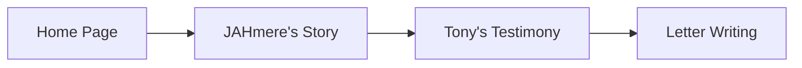
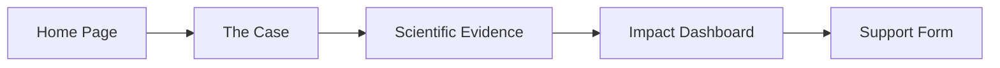
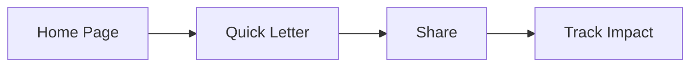

# The Bridge Project - Website UX/UI State Documentation

## 🔄 Last Updated
This document is automatically updated whenever changes are made to the public-facing codebase.

## 📋 Table of Contents
1. [Executive Summary](#executive-summary)
2. [Current State Analysis](#current-state-analysis)
3. [Page-by-Page Breakdown](#page-by-page-breakdown)
4. [User Journeys](#user-journeys)
5. [Interaction Points](#interaction-points)
6. [Ideal State Vision](#ideal-state-vision)
7. [Gap Analysis](#gap-analysis)
8. [Implementation Priorities](#implementation-priorities)

## Executive Summary

The Bridge Project's website serves as a crucial platform for advocating JAHmere Webb's case and gathering community support. The site employs a sophisticated multi-layered approach to storytelling and engagement, utilizing various psychological triggers and user experience patterns to maximize impact and conversion.

### Key Metrics
- Primary Conversion: Letter writing to Judge Ferrero
- Secondary Conversion: Volunteer sign-ups
- Tertiary Goals: Social sharing, community building
- Target Response Rate: 25% of visitors write letters

### Core User Paths
1. Emotional Connection → Understanding → Action
2. Quick Support → Immediate Letter Writing
3. Deep Dive → Comprehensive Understanding → Multiple Support Actions

## Current State Analysis

### Global Elements

#### Navigation System
- **Primary Navigation**
  - Home (/)
  - The Case (/the-case)
  - Impact Dashboard (/impact)
  - Contact (/contact)
  - People Profiles (/people/*)

#### Persistent Elements
- Floating CTA for July 9th Strategy
- Mobile sticky bar
- Trust indicators
- Support counter
- Case status updates

#### Global CTAs
- Write Letter
- Support Now
- Share Story
- Track Progress

### Technical Implementation
- Next.js 14 App Router
- Client/Server Component Separation
- Dynamic Imports for Performance
- Error Boundaries Implementation
- TypeScript Strict Mode

## Page-by-Page Breakdown

### 1. Home Page (/)

#### Purpose
Central hub for emotional connection and primary call-to-action

#### Key Sections
1. **Hero Section**
   - Dynamic hero component
   - Urgency banner
   - Trust bar
   - Support counter

2. **Decision Countdown**
   - Days remaining
   - Urgency indicators
   - Direct CTA

3. **Jay Forte Testimony**
   - Scientific evidence
   - Talent assessment
   - Professional credibility

4. **Problem/Solution**
   - Current reality (73% recidivism)
   - Bridge alternative
   - Cost comparison
   - Success metrics

5. **Tony Dungy's Testimony**
   - Personal endorsement
   - Mentorship evidence
   - NFL credibility

6. **Transformation Justice Lab**
   - Proposal overview
   - Economic impact
   - Youth reach metrics
   - Taxpayer savings

7. **Call to Action Section**
   - Letter writing
   - Story sharing
   - Progress tracking
   - Community impact

#### User Interactions
- Primary CTA: "Support JAHmere's Case" → /contact
- Secondary CTAs:
  - "Read Scientific Evidence" → /people/jay-forte
  - "View Full Proposal" → /justice-lab-proposal
  - "Write a Letter" → /letter-form-test

#### Current Issues
1. Inconsistent button destinations
2. Multiple letter-writing paths
3. Incomplete social sharing implementation

### 2. The Case Page (/the-case)

#### Purpose
Detailed case presentation and evidence compilation

#### Key Sections
1. **Overview Tab**
   - Situation summary
   - Key statistics
   - Core arguments

2. **Timeline Tab**
   - Chronological progression
   - Key milestones
   - Future dates

3. **Program Tab**
   - Bridge Project details
   - Implementation plan
   - Success metrics

4. **Legal Tab**
   - Legal framework
   - Precedents
   - Judge's options

#### User Interactions
- Primary: "Write to Judge Ferrero" → /judge-ferrero-letter
- Secondary: "View Community Support" → /impact

### 3. Impact Dashboard (/impact)

#### Purpose
Visualization of community support and movement progress

#### Key Sections
1. **Support Metrics**
   - Letter count
   - Volunteer numbers
   - Community reach

2. **Coalition Map**
   - Supporting organizations
   - Geographic spread
   - Impact zones

3. **Real-time Updates**
   - Recent supporters
   - Latest testimonies
   - Movement milestones

#### User Interactions
- Join coalition form
- Support letter submission
- Social sharing tools

### 4. Contact Page (/contact)

#### Purpose
Direct engagement and support submission

#### Key Sections
1. **Letter Writing**
   - Guided form
   - Template options
   - Personal story section

2. **Volunteer Registration**
   - Skills assessment
   - Availability input
   - Area of interest

3. **Direct Contact**
   - Emergency contact
   - Media inquiries
   - General questions

#### User Interactions
- Form submissions
- File uploads
- Contact method selection

## User Journeys

### Journey 1: Emotional Connection

### Journey 2: Logical Persuasion

### Journey 3: Quick Support

## Interaction Points

### Primary Conversions
1. Letter Writing
   - Multiple entry points
   - Guided process
   - Template support
   - Personal story integration

2. Volunteer Sign-up
   - Skills matching
   - Commitment levels
   - Impact tracking
   - Community connection

### Secondary Interactions
1. Social Sharing
   - Pre-written messages
   - Impact statistics
   - Personal story angles
   - Multi-platform support

2. Progress Tracking
   - Email updates
   - Dashboard access
   - Milestone notifications
   - Community achievements

## Ideal State Vision

### Enhanced User Experience

#### 1. Personalized Journeys
- AI-driven path optimization
- Content adaptation based on user behavior
- Custom engagement recommendations
- Personal impact tracking

#### 2. Seamless Integration
- Single sign-on across features
- Progressive web app capabilities
- Real-time updates and notifications
- Cross-device synchronization

#### 3. Advanced Engagement
- Interactive storytelling elements
- Virtual reality court experience
- Live community updates
- Direct mentor connections

### Technical Improvements

#### 1. Performance
- Sub-second page loads
- Optimized image delivery
- Predictive pre-loading
- Offline capabilities

#### 2. Accessibility
- WCAG 2.1 AAA compliance
- Screen reader optimization
- Keyboard navigation enhancement
- Color contrast perfection

#### 3. Analytics
- User journey tracking
- Conversion optimization
- A/B testing framework
- Impact measurement

## Gap Analysis

### Current Gaps

#### 1. Technical
- Incomplete error handling
- Missing analytics integration
- Inconsistent loading states
- Form validation gaps

#### 2. User Experience
- Navigation inconsistencies
- Incomplete social sharing
- Multiple letter writing paths
- Progress tracking limitations

#### 3. Content
- Duplicate CTAs
- Inconsistent messaging
- Missing success stories
- Incomplete resource section

### Priority Fixes

#### Immediate (Next Sprint)
1. Standardize letter writing flow
2. Implement social sharing
3. Fix navigation inconsistencies
4. Complete form validation

#### Short-term (30 Days)
1. Analytics integration
2. User journey tracking
3. Progress visualization
4. Community dashboard

#### Long-term (90 Days)
1. AI-driven personalization
2. Virtual reality features
3. Mobile app development
4. Advanced impact tracking

## Implementation Priorities

### Phase 1: Foundation
1. Standardize user flows
2. Fix technical gaps
3. Implement analytics
4. Complete documentation

### Phase 2: Enhancement
1. Advanced features
2. AI integration
3. Mobile optimization
4. Community tools

### Phase 3: Innovation
1. VR/AR features
2. Predictive engagement
3. Advanced personalization
4. Global scaling

## Maintenance Protocol

This document is automatically updated through:
1. Code change detection
2. UI/UX modification tracking
3. Link relationship mapping
4. User journey analysis

The update process ensures:
- Real-time accuracy
- Version control
- Change tracking
- Impact assessment 