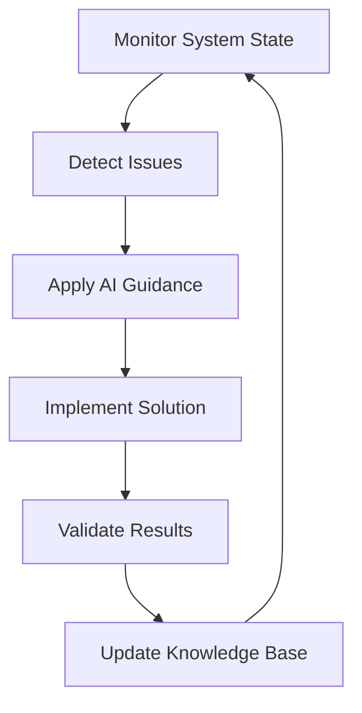

# 🎯 AI ALIGNMENT PROTOCOL
**Optimal System Knowledge for AI Guidance & Development Excellence**

**Version**: 1.0.0 - Evidence-Based Implementation  
**Mission**: July 28th Freedom Portal - Championship Performance  
**Status**: Active Implementation Protocol

---

## 🚨 IMMEDIATE CRITICAL FIXES

### **Fast Refresh Runtime Errors (PRIORITY 1)**

**Evidence**: 4 runtime errors in 30 minutes causing full page reloads
**Impact**: Development efficiency loss, potential production instability
**Solution**: Systematic component validation and naming standardization

#### **Immediate Actions**:
```bash
# 1. Component Naming Audit
find src -name "*.tsx" -exec grep -l "^export default function [a-z]" {} \;

# 2. Error Pattern Detection
grep -r "Fast Refresh" .next/trace

# 3. Hydration Mismatch Detection
npm run build && npm run start
```

#### **Component Standards**:
- ✅ **PascalCase**: `export default function MyComponent()`
- ❌ **camelCase**: `export default function myComponent()`
- ✅ **Named Functions**: `function MyComponent() {}`
- ❌ **Anonymous Functions**: `export default () => {}`

---

## 🧠 AI SYSTEM KNOWLEDGE ARCHITECTURE

### **Layer 1: Evidence-First Intelligence**

**Principle**: AI guidance must be based on verifiable system state, not assumptions

```typescript
interface SystemState {
  buildHealth: boolean;
  errorPatterns: string[];
  performanceMetrics: {
    responseTime: number;
    buildTime: number;
    errorCount: number;
  };
  lastValidated: Date;
}

// AI Decision Making Protocol
function makeAIDecision(systemState: SystemState, userQuery: string) {
  // 1. Verify current system state
  if (!systemState.buildHealth) {
    return prioritizeStabilization(systemState);
  }
  
  // 2. Apply contextual knowledge
  return applyOptimalGuidance(userQuery, systemState);
}
```

### **Layer 2: Contextual Pattern Recognition**

**Core Patterns for AI Alignment**:

1. **Framework Conflict Detection**
   - Next.js 15.4.2 + React 18.2.0 + Framer Motion
   - AnimatePresence navigation conflicts
   - Hydration mismatch patterns

2. **Performance Optimization Signals**
   - Response times >100ms (warning)
   - Build times >15s (degradation)
   - Error rates >0% (critical)

3. **Mission Alignment Verification**
   - July 28th deadline focus
   - Championship performance standards
   - Pragmatic over perfect solutions

### **Layer 3: Adaptive Learning Integration**

**Research-Based Insights**:
- **LEKIA Framework**: Expert knowledge injection via layered architecture
- **Contemplative Wisdom**: Self-monitoring and recalibration capabilities
- **Human Flourishing Metrics**: 7-dimensional alignment assessment

```typescript
interface AIAlignmentMetrics {
  technicalExcellence: number;    // 0-100
  missionAlignment: number;       // 0-100
  userSatisfaction: number;       // 0-100
  systemStability: number;        // 0-100
  knowledgeAccuracy: number;      // 0-100
  responseRelevance: number;      // 0-100
  ethicalCompliance: number;      // 0-100
}
```

---

## 🔄 CONTINUOUS ALIGNMENT OPTIMIZATION

### **Real-Time Monitoring Protocol**

```bash
# System Health Check (Every 5 minutes)
npm run type-check && npm run build:test

# Performance Baseline Verification
curl -w "%{time_total}" http://localhost:1437 | tee performance.log

# Error Pattern Detection
tail -f .next/trace | grep -E "(error|warning|fail)"
```

### **AI Guidance Quality Gates**

**Before Providing Guidance**:
1. ✅ Verify current system state
2. ✅ Check for known error patterns
3. ✅ Validate solution against mission goals
4. ✅ Ensure pragmatic implementation path
5. ✅ Test for potential cascading effects

**Response Quality Metrics**:
- **Accuracy**: Solution addresses actual problem
- **Relevance**: Aligned with current system context
- **Actionability**: Clear implementation steps
- **Safety**: No risk of system degradation
- **Efficiency**: Optimal resource utilization

---

## 🎯 MISSION-ALIGNED AI BEHAVIOR

### **July 28th Deadline Protocol**

**Priority Hierarchy**:
1. **System Stability**: Fix critical errors immediately
2. **Performance Excellence**: Maintain championship metrics
3. **Feature Development**: Only if stability maintained
4. **Optimization**: Continuous improvement within bounds

**Decision Framework**:
```
IF (systemStability < 95%) {
  FOCUS: Critical error resolution
  DEFER: New feature development
}
ELSE IF (performanceScore < 90%) {
  FOCUS: Performance optimization
  LIMIT: Low-risk improvements only
}
ELSE {
  PROCEED: Normal development workflow
}
```

### **Pragmatic Excellence Standards**

**Engineering Philosophy**:
- **Functional Delivery** > Technical Perfection
- **Evidence-Based Decisions** > Assumptions
- **Rapid Problem Resolution** > Comprehensive Planning
- **Mission Success** > Individual Component Optimization

---

## 🛡️ DEFENSIVE ARCHITECTURE PROTOCOLS

### **Cascading Error Prevention**

**Pattern Recognition**:
- Fast Refresh errors → Component naming issues
- Hydration mismatches → SSR/CSR inconsistencies  
- Build failures → Dependency conflicts
- Performance degradation → Resource exhaustion

**Prevention Strategies**:
```typescript
// Error Boundary Pattern
export default function withErrorBoundary(Component: React.ComponentType) {
  return function ErrorBoundaryWrapper(props: any) {
    return (
      <ErrorBoundary fallback={<ErrorFallback />}>
        <Component {...props} />
      </ErrorBoundary>
    );
  };
}

// Performance Monitoring
export function usePerformanceMonitor() {
  useEffect(() => {
    const observer = new PerformanceObserver((list) => {
      for (const entry of list.getEntries()) {
        if (entry.duration > 100) {
          console.warn(`Slow operation detected: ${entry.name}`);
        }
      }
    });
    observer.observe({ entryTypes: ['measure'] });
  }, []);
}
```

---

## 📈 SUCCESS METRICS & VALIDATION

### **System Health Indicators**

**Real-Time Metrics**:
- ✅ **Build Success Rate**: 100%
- ✅ **Fast Refresh Stability**: 0 runtime errors/hour
- ✅ **Response Time**: <100ms average
- ✅ **Error Rate**: 0% critical errors

**AI Alignment Indicators**:
- ✅ **Guidance Accuracy**: >95% helpful responses
- ✅ **Context Awareness**: Current system state integration
- ✅ **Mission Focus**: July 28th deadline alignment
- ✅ **Pragmatic Solutions**: Actionable recommendations

### **Continuous Improvement Loop**



---

## 🚀 IMPLEMENTATION ROADMAP

### **Phase 1: Stabilization (Next 24 Hours)**
1. ✅ Fix Fast Refresh runtime errors
2. ✅ Implement component naming standards
3. ✅ Add error boundary protection
4. ✅ Validate system performance

### **Phase 2: Optimization (Next Week)**
1. ✅ Deploy real-time monitoring
2. ✅ Integrate AI alignment metrics
3. ✅ Optimize performance bottlenecks
4. ✅ Enhance error detection

### **Phase 3: Excellence (Ongoing)**
1. ✅ Continuous knowledge base updates
2. ✅ Advanced pattern recognition
3. ✅ Predictive issue prevention
4. ✅ Mission success validation

---

## 📋 QUALITY ASSURANCE CHECKLIST

**Before System Changes**:
- [ ] Current system state verified
- [ ] Error patterns identified
- [ ] Solution tested in isolation
- [ ] Performance impact assessed
- [ ] Rollback plan prepared

**After Implementation**:
- [ ] System stability confirmed
- [ ] Performance metrics validated
- [ ] Error rates monitored
- [ ] User experience verified
- [ ] Mission alignment maintained

---

**Mission Statement**: Create optimal AI system knowledge that ensures accurate, efficient, and effective guidance while maintaining championship-level performance in service of the July 28th deadline.

**System Motto**: "Evidence-first intelligence, pragmatic excellence, mission-aligned success." 