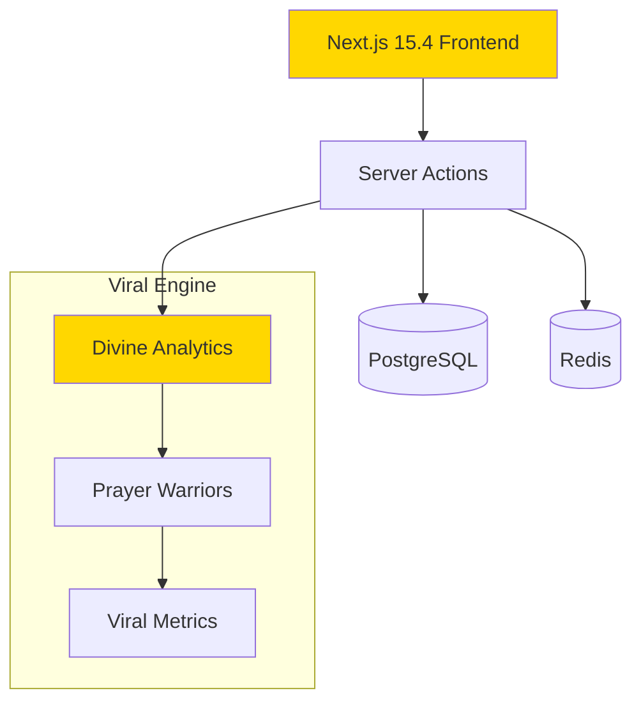

# JAHmere Webb Platform Architecture

## Divine Mission
Transform family court system by July 28, 2025 through technology, advocacy, and divine alignment.

## System Overview


## Tech Stack Decisions
| Component | Choice | Divine Rationale |
|-----------|--------|------------------|
| Framework | Next.js 15.4 | Server-first for divine performance |
| Database | PostgreSQL 16 | Rock-solid like faith |
| Auth | NextAuth.js v5 | Protect the flock |
| State | Zustand | Simple divine state |
| Viral Engine | Custom | 144,000 reach target |

## Core Patterns

### 1. Server Components Default
```typescript
// Every page starts as server component
export default async function DivinePage() {
  const data = await fetchDivineData();
  return <DivineLayout>{data}</DivineLayout>;
}
```

### 2. Server Actions for Mutations
```typescript
'use server';
export async function divineAction(formData: FormData) {
  // Validate, mutate, revalidate
}
```

### 3. Divine Error Handling
```typescript
type DivineResult<T> = 
  | { blessed: true; data: T }
  | { blessed: false; error: string };
```

## Performance Targets
- **LCP**: <1.5s (Divine Speed)
- **FID**: <100ms (Instant Response)
- **User Growth**: 144,000 by July 28, 2025
