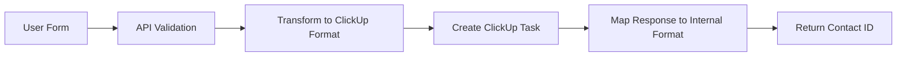
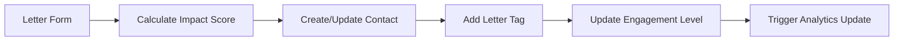

# ClickUp CRM Integration Guide

## Overview

The Bridge Project integrates with ClickUp CRM to manage contacts, track engagement, and analyze community impact. This guide covers setup, configuration, and usage of the ClickUp CRM integration.

## Table of Contents

1. [Initial Setup](#initial-setup)
2. [Field Mapping Configuration](#field-mapping-configuration)
3. [API Endpoints](#api-endpoints)
4. [Data Flow](#data-flow)
5. [Usage Examples](#usage-examples)
6. [Troubleshooting](#troubleshooting)
7. [Security Considerations](#security-considerations)

## Initial Setup

### 1. Environment Variables

Add these to your `.env.local` file:

```env
# ClickUp Integration
CLICKUP_API_KEY=pk_YOUR_CLICKUP_API_KEY_HERE
CLICKUP_LIST_ID=9011549512  # Your CRM list ID
CLICKUP_SPACE_ID=YOUR_SPACE_ID
CLICKUP_TEAM_ID=YOUR_TEAM_ID
```

### 2. Get Your ClickUp API Key

1. Log into ClickUp
2. Navigate to Settings → Apps
3. Click "Generate" under API Token
4. Copy the token (starts with `pk_`)

### 3. Find Your List ID

The list ID is in your ClickUp URL when viewing the CRM list:
```
https://app.clickup.com/9011549512/l/li/901154951
                        ^^^^^^^^^^ (This is your list ID)
```

### 4. Initialize Field IDs

Run this command to fetch your custom field IDs:

```bash
npm run clickup:fetch-fields
```

This will output the field IDs you need to update in `src/lib/crm/clickup-field-mapping.ts`.

## Field Mapping Configuration

### ClickUp Custom Fields

Your ClickUp CRM uses these custom fields:

| Field Name | Type | Bridge Project Mapping |
|------------|------|----------------------|
| Company Logo | Attachment | Not mapped (future) |
| Contact Person | Text | `contactPerson` |
| Company Email Address | Email | `companyEmail` |
| Contact Person Email | Email | `contactEmail` |
| Phone Number | Phone | `phoneNumber` |
| Contact Phone Number | Phone | `contactPhoneNumber` |
| Fax Number | Phone | `faxNumber` |
| Business Category | Labels | `businessCategory` |
| Product/Services | Text | `productServices` |
| Business Website | URL | `website` |
| Company Address | Location | `address` |
| Location Covered | Location | `locationCovered` |
| Establishment Date | Date | `establishmentDate` |
| Keywords | Text | `keywords` |

### Business Categories

The integration maps Bridge Project engagement levels to ClickUp business categories:

```typescript
// Bridge Project → ClickUp Mapping
'high' engagement    → 'CONSULTING'
'medium' engagement  → 'MARKETING'
'low' engagement     → 'SOFTWARE'
```

## API Endpoints

### 1. Contact Management

#### Create Contact
```http
POST /api/crm/contacts
Content-Type: application/json

{
  "firstName": "John",
  "lastName": "Doe",
  "email": "john@example.com",
  "phone": "555-1234",
  "relationship": "Mentor",
  "connectionStrength": "Strong",
  "engagementLevel": "high"
}
```

#### Get Contact
```http
GET /api/crm/contacts?id=TASK_ID
```

#### Update Contact
```http
PUT /api/crm/contacts
Content-Type: application/json

{
  "id": "TASK_ID",
  "engagementLevel": "medium",
  "letterSubmitted": true
}
```

#### Search Contacts
```http
GET /api/crm/contacts?query=john&engagementLevel=high&page=1&limit=20
```

### 2. Analytics

#### Get CRM Analytics
```http
GET /api/crm/analytics
```

Response:
```json
{
  "success": true,
  "data": {
    "totalContacts": 150,
    "contactsByEngagementLevel": {
      "high": 45,
      "medium": 60,
      "low": 45
    },
    "letterConversionRate": 0.35,
    "volunteerConversionRate": 0.15
  }
}
```

### 3. Sync Operations

#### Bulk Import
```http
POST /api/crm/sync
Content-Type: application/json

{
  "mode": "import",
  "contacts": [
    {
      "firstName": "Jane",
      "lastName": "Smith",
      "email": "jane@example.com",
      "relationship": "Community Leader",
      "connectionStrength": "Moderate",
      "engagementLevel": "medium"
    }
  ]
}
```

#### Sync Existing
```http
POST /api/crm/sync
Content-Type: application/json

{
  "mode": "sync",
  "contacts": [...]
}
```

## Data Flow

### Contact Creation Flow



### Letter Submission Flow



## Usage Examples

### JavaScript/TypeScript

```typescript
// Create a new contact
const response = await fetch('/api/crm/contacts', {
  method: 'POST',
  headers: { 'Content-Type': 'application/json' },
  body: JSON.stringify({
    firstName: 'Michael',
    lastName: 'Johnson',
    email: 'michael@example.com',
    relationship: 'Youth I Helped',
    connectionStrength: 'Close',
    engagementLevel: 'high'
  })
});

const { data } = await response.json();
console.log('Created contact:', data.id);
```

### React Hook Example

```typescript
import { useState, useEffect } from 'react';

function useClickUpContacts(query?: string) {
  const [contacts, setContacts] = useState([]);
  const [loading, setLoading] = useState(true);
  
  useEffect(() => {
    async function fetchContacts() {
      const params = new URLSearchParams();
      if (query) params.set('query', query);
      
      const res = await fetch(`/api/crm/contacts?${params}`);
      const data = await res.json();
      
      setContacts(data.data);
      setLoading(false);
    }
    
    fetchContacts();
  }, [query]);
  
  return { contacts, loading };
}
```

## Troubleshooting

### Common Issues

#### 1. "Missing required environment variable"
**Solution:** Ensure all ClickUp environment variables are set in `.env.local`

#### 2. "ClickUp API error: 401"
**Solution:** Your API key is invalid or expired. Generate a new one in ClickUp settings.

#### 3. "Field ID not found"
**Solution:** Run `npm run clickup:fetch-fields` and update the field mapping.

#### 4. "Rate limit exceeded"
**Solution:** The integration implements rate limiting. Wait 60 seconds before retrying.

### Debug Mode

Enable debug logging by setting:
```env
CLICKUP_DEBUG=true
```

This will log all ClickUp API requests and responses to the console.

## Security Considerations

### 1. API Key Security
- Never commit API keys to version control
- Use environment variables for all sensitive data
- Rotate API keys regularly

### 2. Rate Limiting
The integration implements rate limiting:
- 10 requests per minute per IP
- Prevents API abuse
- Returns 429 status when exceeded

### 3. Input Validation
All inputs are validated using Zod schemas:
- Email format validation
- Required field checks
- Type validation

### 4. Audit Logging
All CRM operations are logged:
```typescript
[AUDIT] CRM operation: {
  action: 'create_contact',
  timestamp: '2024-01-01T00:00:00Z',
  userId: 'user123',
  contactId: 'abc123',
  ip: '192.168.1.1'
}
```

### 5. Error Handling
- Never expose internal errors to clients
- Sanitize all error messages
- Log full errors server-side only

## Best Practices

### 1. Batch Operations
When importing multiple contacts:
```typescript
// Good - Batch import
await fetch('/api/crm/sync', {
  method: 'POST',
  body: JSON.stringify({
    mode: 'import',
    contacts: [/* array of contacts */]
  })
});

// Bad - Individual requests
for (const contact of contacts) {
  await fetch('/api/crm/contacts', {
    method: 'POST',
    body: JSON.stringify(contact)
  });
}
```

### 2. Caching
Implement client-side caching for frequently accessed data:
```typescript
const CACHE_TIME = 5 * 60 * 1000; // 5 minutes
let cache = { data: null, timestamp: 0 };

async function getCachedContacts() {
  if (Date.now() - cache.timestamp < CACHE_TIME) {
    return cache.data;
  }
  
  const data = await fetchContacts();
  cache = { data, timestamp: Date.now() };
  return data;
}
```

### 3. Error Recovery
Always implement error handling:
```typescript
try {
  const contact = await createContact(data);
  // Success flow
} catch (error) {
  if (error.status === 429) {
    // Rate limited - retry after delay
    setTimeout(() => createContact(data), 60000);
  } else {
    // Handle other errors
    console.error('Failed to create contact:', error);
  }
}
```

## Advanced Features

### Custom Field Extensions

To add new custom fields:

1. Add field in ClickUp UI
2. Run `npm run clickup:fetch-fields`
3. Update `clickup-field-mapping.ts`
4. Update mapping functions

### Webhook Integration (Future)

ClickUp webhooks can notify your app of changes:
```typescript
// Future webhook handler
export async function handleClickUpWebhook(event: any) {
  switch (event.event) {
    case 'taskCreated':
      // Handle new contact
      break;
    case 'taskUpdated':
      // Sync changes
      break;
  }
}
```

## Support

For issues or questions:
1. Check the [Troubleshooting](#troubleshooting) section
2. Review ClickUp API docs: https://clickup.com/api
3. Contact The Bridge Project development team 